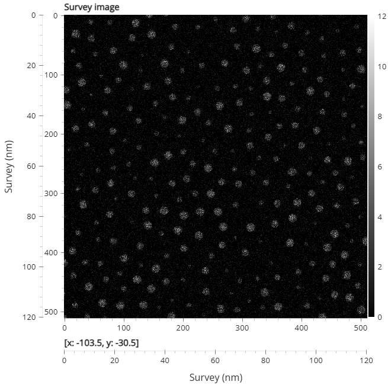
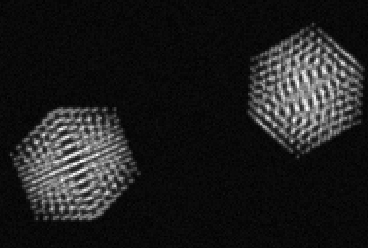
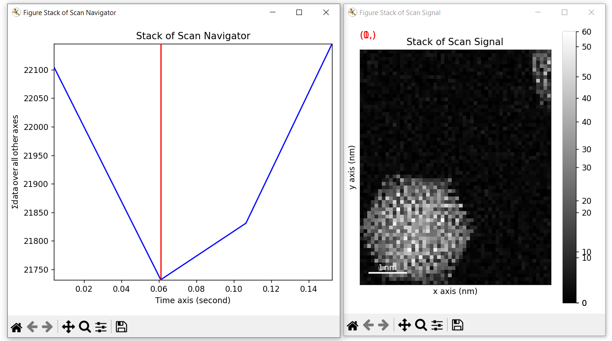
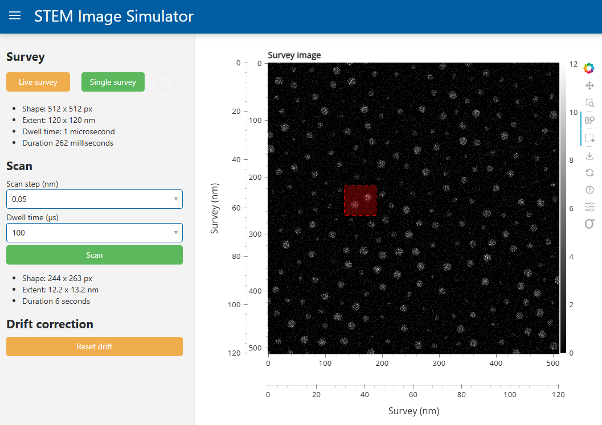

# QEM 2025 Image Processing Practical Session

Describes the practical session for QEM2025 related to image processing.

## Setup

The working directory `TP Images` is on the Desktop. Inside there is a shortcut to open a `Terminal` with the correct `conda` environment activated. If you don't see `(TP_AI)` before the prompt then activate the `conda` environment using:

```powershell
conda activate TP_AI
```

If `conda` is not recognized as a command then run:

```powershell
C:\ProgramData\anaconda3\shell\condabin\conda-hook.ps1
```

then run the `activate` command from above.

You can then update the course materials using:

```powershell
tp-update
```

To open a Jupyter Notebook, within the terminal type:

```powershell
jupyter lab
```

or you can use Python or notebooks from VSCode directly. Just be sure that `TP_AI` is displayed in the terminal or VSCode interface. Same for Anaconda Navigator.

### Juypter interactive figures

To have HyperSpy figures be interactive, add the following to a cell at the top of your notebook and run it:

```python
%matplotlib widget
```

## Objective

The objective is to carry out STEM imaging measurements (radius, area etc.) of a sample of gold nanoparticles using a simulated microscope. The simulated microscope in its default state has a drifting stage, so we cannot use the survey image to identify where to run a high-resolution scan, be cause the particle will move outside the field of view by the time we run it.

## Simulator

The simulator reproduces ADF-STEM imaging on a sample of nanoparticles which are drifting through the field of view. The simulator can be created like so:

```python
from qem_practical.simulator import STEMImageSimulator

simulator = STEMImageSimulator.default()
```

The `default()` method can be called with `drift_speed=0.` to completely disable drifting, as needed in exercise 1.

The simulator object has two primary user-facing methods, one to acquire a survey image:

```python
survey_image = simulator.survey_image(dwell_time=1e-6)  # seconds
```

where `survey_image` is a `512x512` [HyperSpy](https://hyperspy.org/hyperspy-doc/current/user_guide/index.html)
`Signal2D` image of the field of view.



The simulator can also acquire a detailed STEM scan:

```python
scan_image = simulator.scan(
    centre=(61.3, 34.2),  # (y, x) centre of the scan grid in the coordinate system of the survey image, in NanoMetres
    scan_shape=(100, 180),  # (y, x) scan grid shape (integer)
    scan_step=0.1,  # scan grid stepsize in nm
    dwell_time=1e-6,
)
```

where `scan_image` is a [HyperSpy](https://hyperspy.org/hyperspy-doc/current/user_guide/index.html)
`Signal2D` of size `scan_shape` scanned around `centre`.



**NOTE:** the dwell time is simulated *realistically*, if your request to scan will take more than 10 seconds then the simulator will require you to override a safeguard so you don't have to wait minutes for an image...

The output `Signal2D` images are calibrated to the coordinate system of the simulator using the normal HyperSpy system detailed [here](https://hyperspy.org/hyperspy-doc/current/reference/base_classes/axes.html#hyperspy.axes.AxesManager):

```python-repl
>>> survey_image.axes_manager
<Axes manager, axes: (|512, 512)>
            Name |   size |  index |  offset |   scale |  units
================ | ====== | ====== | ======= | ======= | ======
---------------- | ------ | ------ | ------- | ------- | ------
               x |    512 |      0 |       0 |    0.24 |     nm
               y |    512 |      0 |       0 |    0.24 |     nm
```

and so can be used for coordinate transformations:

```python-repl
# nm to pixels
x_px = survey.axes_manager["x"].value2index(62.3)
```

and slice into an image using continuous coordinates (see [here](https://hyperspy.org/hyperspy-doc/current/user_guide/axes.html#the-navigation-and-signal-dimensions)):

```python
# slice an ROI with nanometres
survey_image.isig[12.3:24.9, 38.2:45.1]
```

**NOTE:** HyperSpy `isig` uses indexing as `(x, y)`, i.e. horizontal-vertical which is the opposite of `numpy` and matrix notation.

For convenience the simulator also provides its own coordinate transformation helpers:

```python
py, px = 32, 46
(ny, nx) = simulator.survey.to_continuous((py, px))  # convert from (y, x) pixels to nanometres
(py, px) = simulator.survey.to_pixels((ny, nx))  # convert from (y, x) nanometres to pixels
(sy, sx) = simulator.survey.scaling  #  scaling of the survey field of view in nm / pixel
(ey, ex) = simulator.survey.extent  # size of the survey field of view in nm
```

We can also plot our signals using HyperSpy, and use `matplotlib` to add additional annotations:

```python
import matplotlib.pyplot as plt
plt.figure()
survey_image.plot()
plt.plot(xcoord, ycoord)  # note x and y coords must be in nanometres as HyperSpy created the axes!
plt.show()
```



The returned `Signal2D` also contains metadata about the scan for information:

```python
survey_image.metadata
```

returns the following:

- `title`: Survey image
- `current`: Quantity(1e-11, 'ampere')
- `dwell_time`: Quantity(1e-05, 'second')
- `rotation`: Quantity(0.0, 'degree')
- `scan_end`: Quantity(2.62452228, 'second')
- `scan_start`: Quantity(0.00308227539, 'second')

There is also a UI version of the simulator which will launch in a web browser with, but this is only for demonstration purposes, not the coding exercise:

```python
simulator.show()
```



## Notes and hints

HyperSpy can handle more than just spectra; it has a number of image processing features which will **very** be useful for the exercises. Consider reading the user guide of [Signal2D](https://hyperspy.org/hyperspy-doc/current/user_guide/signal2d.html) and its [documentation](https://hyperspy.org/hyperspy-doc/current/reference/api.signals/Signal2D.html#hyperspy.api.signals.Signal2D).

Any HyperSpy signal has a `numpy` array underneath which can be accessed using `signal.data`. This can be useful for plotting with `matplotlib` or passing signals to non-HyperSpy functions.

## Exercises

In order of increasing difficulty, with no obligation to complete all steps.

### 1 - Detect, image and measure particles without drift

Create the simulator with argument `drift_speed=0.` given to `STEMImageSimulator.default()` to disable drifting. This means we can treat the survey image as *static* and measure any particle within the field of view without distortion or tracking.

- From a survey image taken at a decent dwell time (`1e-5`) locate all of the particles in the field of view using a peak-finding approach
  - HyperSpy provides a method `signal.find_peaks()`, documented [here](https://hyperspy.org/hyperspy-doc/current/reference/api.signals/Signal2D.html#hyperspy.api.signals.Signal2D.find_peaks).
  - Give the argument `interactive=False` to avoid showing the UI in the Jupyter Notebook
  - You will need to limit the number of peaks it returns, use `min_distance=20` or more as an extra argument.
  - The raw data for the peak positions can be found from the returned results as `peaks.data[0]`
  - The peaks are returned as `[y, x]` positions in *pixels*.
- For some of the detected particles run a STEM `simulator.scan()` of each and display a few of the images
  - Remember, `simulator.scan` takes nano-metre coordinates for the centre of the scan grid. You can convert to nanometre coordinates with `simulator.survey.to_continuous((pixel_y, pixel_x))`.
- For each detailed image use thresholding of the numbpy array (`scan_image.data`) to segment the particle from the background and measure its properties (e.g. diameter, circumference, area, circularity).
  - Take a look at [`skimage.measure.regionprops`](https://scikit-image.org/docs/stable/api/skimage.measure.html#skimage.measure.regionprops), which can operate directly on a binary `[0, 1]` image.
  - Try to express the measurements in *nanometres* rather than pixels based on the information you have about each scan.
- Plot the distributions of the above values as histograms (`plt.hist`).

### 2 - Estimate the drift and correct an image stack

Create a simulator with a random drift speed `drift_speed="random"`. The survey image will now change over time as particles move through the field of view. The drift rate will be approximately constant while the drift direction slowly changes over time.

- Create a survey image with a short dwell time
- Identify or choose a cluster of particles to scan in detail
- Scan the particles repeatedly and estimate the drift vector between successive frames
  - This can be acheived with `simulator.scan(..., stack=8)` to acquire an 8-image stack.
- Plot the drift over time and compare it to the simulator's true drift curve that can computed with:

```python
# drift_dataframe contains columns "timestamp", "yvals", "xvals" in nanometres
timestamps = stack.axes_manager["time"].axis
drift_dataframe = simulator.drift_for_time(timestamps)
```

- Super-impose the acquired images using interpolation to correct for the drift
- Display the summed image stack

### 3 - Live drift correction

If we can estimate the drift rate periodically then we can also shift the scan grid predictively in compensation - in a real microscope you might do this by adjusting *beam shift*. In the simulator we can supply a function `drift_corrector` which takes the timestamp of the scan about to start, and shifts the supplied `centre` of the scan grid by some amount. A simple function to do this would be:

```python
def predict_drift(scan_time: float) -> tuple[float, float]:
    return (1. * scan_time, -0.3 * scan_time)
```

which would move the supplied scan `centre` coordinate by `(1, -0.3)` nm for every second since the simulator was created.

Such a function would need to be created from a sequence of drift-measurement acquisitions, then applied to a new scan. The function would be less and less valid over time as the drift of the sample is not stable. The correction function would therefore need to be re-measured periodically.

- Acquire a survey image and select a zone to track
- Acquire a stack of images of the tracking region
- Evaluate the drift as in exercise 2, then fit a function to predict it as a function of scan time
  - The `"time"` axis of a stack acquisition is calibrated to scan time
- Supply the `drift_corrector` function to a new stack acquisition on the same or a new area
- Plot the results to prove the drift correction is working
  - Sum an uncorrected stack and a corrected stack to see if the detail improves
  - Generate a GIF of the scan images using `imageio.v3.imwrite`

### Extension: Kalman Filter

A Kalman filter is a statistical technique to estimate both the tendency and noise in a time-series of measurements. It is often used in motion tracking and prediction tools, for example in GPS software. Try to implement a Kalman filter to smooth and better-predict the drift of the sample.

### GPU Implementation

Look into the `cupy` Python library and see if you can write the Python code to do drift estimation using the GPU.
